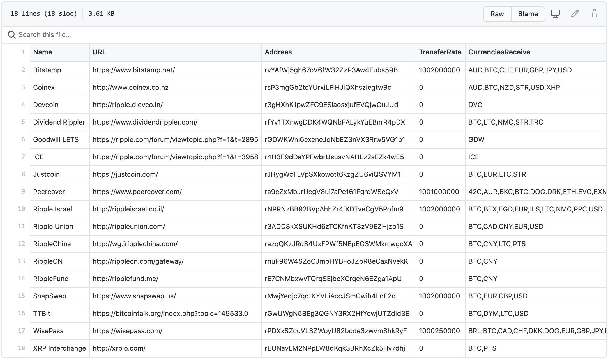

# Ripple Network

[![Build Status][build-status-svg]][build-status-url]
[![Go Report Card][goreport-svg]][goreport-url]
[![Docs][docs-godoc-svg]][docs-godoc-url]
[![License][license-svg]][license-url]

This package provides a list of public Rippled servers and Gateways.

## Gateways

Known gateways are listed in the [`gateways.csv`](gateways.csv) and [`gateways.json`](gateways.json) files. This is is built from online sources and periodically updated with AccountRoot info using the script in [`cmd/build_gateways_data/main.go`](cmd/build_gateways_data/main.go).

Gateways are returned from calling the `Gateways(bool)` function.



## Servers

Servers are returned by calling the `Servers()` function.

| Operator              | Network | JSON-RPC URL        | WebSocket URL                  | Notes |
| --------------------- | ------- | ---------------------------------------- | ------------- | -------------- |
| XRP Ledger Foundation | Mainnet | `https://xrpl.ws/`                       | `wss://xrpl.ws/`                 | Full history server cluster |
| Ripple | Mainnet                | `https://s1.ripple.com:51234/`           | `wss://s1.ripple.com/`           | General purpose server cluster |
| Ripple | Mainnet                | `https://s2.ripple.com:51234/`           | `wss://s2.ripple.com/`           | Full-history server cluster |
| Ripple | Testnet                | `https://s.altnet.rippletest.net:51234/` | `wss://s.altnet.rippletest.net/` | Testnet public server |
| Ripple | Mainnet                | `https://s.devnet.rippletest.net:51234/` | `wss://s.devnet.rippletest.net/` | Devnet public server |

## Testing

### JSON RPC

Test with the following:

```bash
$ curl -H 'Content-Type: application/json' -d '{"method":"server_info"}' https://s1.ripple.com:51234/

$ curl -H 'Content-Type: application/json' -d '{"method":"server_info"}' https://s2.ripple.com:51234/

$ curl -H 'Content-Type: application/json' -d '{"method":"server_info"}' https://s.altnet.rippletest.net:51234/ --insecure

$ curl -H 'Content-Type: application/json' -d '{"method":"server_info"}' https://s.devnet.rippletest.net:51234/ --insecure
```

 [build-status-svg]: https://github.com/goxrp/ripple-network/workflows/go%20build/badge.svg?branch=master
 [build-status-url]: https://github.com/goxrp/ripple-network/actions
 [goreport-svg]: https://goreportcard.com/badge/github.com/goxrp/ripple-network
 [goreport-url]: https://goreportcard.com/report/github.com/goxrp/ripple-network
 [docs-godoc-svg]: https://pkg.go.dev/badge/github.com/goxrp/ripple-network
 [docs-godoc-url]: https://pkg.go.dev/github.com/goxrp/ripple-network
 [license-svg]: https://img.shields.io/badge/license-MIT-blue.svg
 [license-url]: https://github.com/goxrp/ripple-network/blob/master/LICENSE